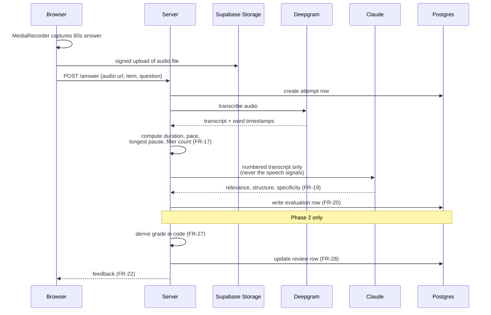
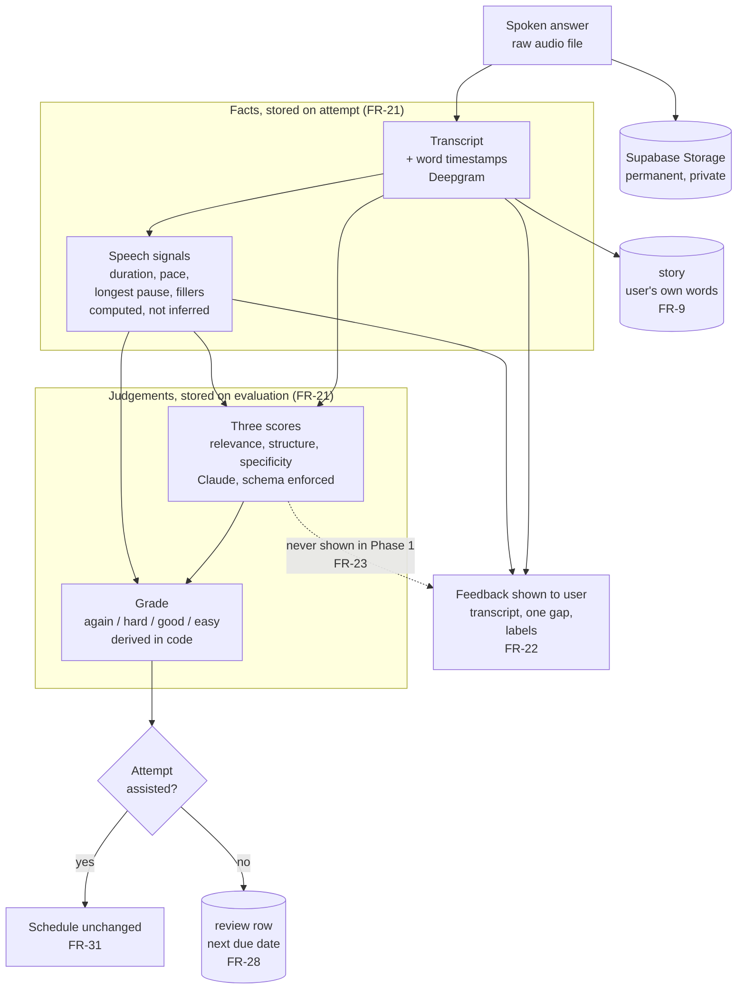

# 02: System Architecture

Product: Retell
Status: Draft for approval
Phase: 1
Owner: Deshan Ekanayaka (engineer of record)
Version: 0.1
Date: 2026-08-22

This document is written as an RFC. It states the chosen design as fact, records what was
rejected and why, and lists the conditions under which each boring choice gets reopened.
It implements the requirements in 01-PRD.md and cites them by FR number.

## 1. Context

Retell records a spoken answer in the browser, transcribes it, scores the transcript against a
three dimension rubric, and shows the user their own words with one gap named. Phase 2 adds a
scheduler that decides which question to ask next.

The backend receives an audio file, stores it, calls two external APIs, writes
rows, and returns them.

The hard parts are not computational. They are browser microphone behaviour (FR-1, FR-2,
FR-34), evaluation quality, and keeping data in a shape that survives changing models
(FR-20, FR-21).

## 2. Constraints

1. **Solo developer.** Fewest moving parts wins any tie.
2. **Free to users in Phase 1.** Per session cost is capped in application code, not by a
   pricing plan (FR-36, FR-37).
3. **The browser is the only capture device.** Audio capture is JavaScript. This is not a
   preference.
4. **Chrome and Chromium only in Phase 1** (FR-34).
5. **Raw audio is permanent and private** (FR-15, FR-38, FR-39).
6. **Facts and judgements are stored separately** so answers can be re-scored without being
   re-recorded (FR-21).

## 3. Chosen design

### 3.1 Stack

| Layer | Choice | One line reason |
| --- | --- | --- |
| Application | Next.js, App Router, TypeScript | Server and client in one codebase, one deploy, one type system |
| Styling | Tailwind | No design system to maintain |
| Hosting | Vercel | No operations work |
| Database | Postgres, via Supabase | The scheduler asks relational questions ("which items are due") |
| Auth | Supabase Auth | Same service as the database, session cookie on the server |
| Object storage | Supabase Storage | Audio lives beside the data that describes it |
| Capture | Browser MediaRecorder | Native, no library |
| Permission | Chrome `usermedia` element, with `getUserMedia` fallback | Best available permission and recovery UX (FR-2) |
| Transcription | Deepgram, pre-recorded, filler words and word timestamps on | Filler words are a flag, not a derivation (FR-16) |
| Evaluation | Claude, schema enforced response | The rubric returns validated JSON, never parsed prose (FR-19) |
| Package manager | pnpm | Fine |
| Tests | Vitest, Playwright later | Deferred until there is behaviour worth pinning |

Single application, not a monorepo. A monorepo for a solo Phase 1 is overhead pretending to be
architecture.

**Rejected: a Python backend.** The browser half must be JavaScript, so Python means two
languages, two deploys, and the shape of every record written twice and drifting apart. The
backend does no numerical work that Python would be better at. Revisit if the product ever
processes audio itself (pitch, energy, speaker separation) rather than sending it away. Offline
corpus analysis for rubric tuning may be written in Python as a separate script without
affecting this decision.

**Rejected: Firebase and Firestore.** The scheduler's central query is "which items are due for
this user now", which is a relational question. Document stores answer it badly.

### 3.2 The answer pipeline

This is the whole product. Everything else is plumbing around it.



Four decisions inside that diagram:

**Audio goes to storage directly from the browser**, using a signed upload, not through a
server route. Serverless request body limits make proxying a media file through an API route
fragile.

**Speech signals are computed, never inferred, and never sent to the model.** Duration, words per
minute and longest pause come from the audio and Deepgram's word timestamps. A language model is
never asked how long someone spoke (FR-17), and since S3 it is not told either. All three rubric
dimensions were chosen because they are observable in the transcript alone
(04-voice-and-evaluation.md section 3.1). Handing the model a duration invites it to fold
speaking time into `specificity`, turning a text-observable score into a partly time-based one,
and no prompt wording reliably stops a model using a number placed in front of it. The signals are
still computed and stored under FR-17; they just do not reach the prompt.

**The model returns three numbers, not a grade.** The mapping from scores to `again`, `hard`,
`good`, `easy` lives in application code so it is deterministic, tunable without touching a
prompt, and replayable over historical attempts (FR-27).

**Evaluation is isolated behind one module**, `lib/evaluate.ts`, which takes a transcript plus
signals and returns the scored result. No other file knows which provider is behind it.
Changing model or vendor is a single file change.

### 3.3 Data flow

The sequence diagram above shows the calls. This shows where the data goes and what derives
from what. Read it as lineage: everything below a box can be rebuilt from the box above it,
which is why the raw audio is permanent (FR-15).



Three things this diagram is making explicit.

**Facts and judgements are separated.** Everything in the left group is measurement. Everything
in the right group is one model's opinion, stamped with which model and which rubric produced
it. Replace the model and the right group is regenerated from the left without anyone
re-recording anything.

**The scores drive the scheduler but not the screen.** The grade reaches the review row; the
numbers do not reach the user in Phase 1 (FR-23).

**An assisted attempt is a dead end for scheduling only.** It is still transcribed, still
scored, still shown feedback. It simply does not move the due date (FR-31).

### 3.4 Data model

Eight tables. Full column list is owned by 04-data-and-privacy.md; the shape and the reasoning
are here.

```
user     -> story    -> item -> review
                          ^
question ----------------/
                          |
session  -> attempt ------/ -> evaluation
```

- **user**: account, target role, timezone (decides when "today" resets).
- **story**: one of the user's own examples, body is their transcript, never generated (FR-9).
- **question**: angle, wording, whether it is a twist, and the plain question it twists.
- **item**: one story paired with one angle. Unique on (user, story, angle). This is the
  scheduled unit (FR-26).
- **session**: one sitting.
- **attempt**: facts about one spoken answer. Audio URL, transcript, word timings, duration,
  pace, longest pause, filler count, the question text, and an `assisted` flag (FR-31).
- **evaluation**: one model's judgement of one attempt, stamped with model and rubric version
  (FR-20). Also carries where the situation, action and result sit, as word positions into the
  attempt's word timings (ADR-017).
- **review**: scheduling state for one item. Due date, interval, ease, reps, lapses.

**The load bearing decision is that `item` points at an angle, not at a question.** Many
questions share an angle, and a twist is another question on the same angle. So an item's
history survives being asked in a different wording, which is the entire point. Angle slugs are
a contract: adding one is fine, renaming one invalidates every item.

**Rejected: the question as the scheduled unit.** The user answers with the same story every
time, becomes fluent at one pairing, and never discovers the other four stories they could have
used.

**Rejected: the story as the scheduled unit.** A story can be strong for one angle and useless
for another, so a single per story schedule averages over a distinction that matters.

**`question_text` on `attempt`, ahead of the `question` table.** S3 needed the question in two
places: `relevance` scores whether the answer addressed it, and section 4 of
04-voice-and-evaluation.md requires it on the feedback screen for a user returning later. Phase 1
asks one question, held as a constant in `lib/questions.ts`, and the wording is copied onto each
attempt rather than referenced. Copying freezes it: reword the question later and yesterday's
feedback screen must still show what that person was actually asked. `question_id` is deferred to
the spec that adds the `question` table, the same way S2 deferred its other foreign keys.

**`recording`, narrowed rather than replaced.** S1 (record and upload) needed somewhere to put
raw audio before `attempt` had any reason to exist, so it introduced a `recording` table (id,
anonymous session id, `recording_type`, audio URL, created at) ahead of this schema. S2 settled
the question left open there: `recording` is not superseded, it narrows. `attempt` now holds
every `answer`-type recording going forward; `recording` keeps its shape and stays the home for
`mic_check`, `validation_a`, and `validation_b`, none of which are ever transcribed. No
`answer`-type `recording` rows were migrated into `attempt` — nothing was deployed to real users
yet, so there was no answer data worth preserving.

### 3.5 Cost control

Three independent limits, all in application code (FR-36, FR-37):

1. Hard spend cap configured in each provider console.
2. One session per user per day; one answer per IP per day for anonymous users.
3. A global daily spend threshold that stops new sessions being accepted.

Anonymous answers exist because feedback is shown before signup (FR-7), which means the
pipeline can be triggered by anyone who finds the URL. Limit 2 is what makes that safe.

### 3.6 Scheduling (Phase 2)

A fixed interval ladder: `again` returns the item later in the same session, `hard` sets one
day, `good` steps 1, 2, 4, 7, 14, `easy` skips a step. Maximum interval 14 days (FR-28).

The cap is the important part. General spaced repetition pushes intervals to months because it
optimises for recall years later. A Retell user is job hunting for about eight weeks, so an
item scheduled 45 days out never returns. The cap matches the real horizon.

**Rejected: FSRS.** It is better than a fixed ladder when there are thousands of reviews per
user to learn from. Retell will have tens.

## 4. Revisit triggers

The conditions under which each boring choice gets reopened. If none of these has occurred, the
choice is not up for debate.

| Decision | Reopen when |
| --- | --- |
| TypeScript everywhere | The product processes audio itself rather than sending it away |
| Chrome only | Anyone outside a recruited test group is expected to use the product |
| Deepgram | Filler word or accent accuracy is measurably wrong on real user audio |
| Claude, and the model tier | The rubric is stable and validated, at which point cheaper tiers are tested against real answers |
| Record and upload, not a live voice agent | Never in Phase 1 or 2. A spoken question is added with text to speech instead |
| Fixed interval ladder | There are more than about 50 reviews per active user |
| Supabase | Storage or auth becomes a bottleneck, or costs exceed the sum of separate services |
| Single application, no monorepo | A second deployable exists |
| No numeric score shown to users (FR-23) | The rubric is validated against real answers and the score is defensible |

## 5. What is deliberately not built

- No queue or background worker. Transcription of a 60 second clip is fast enough to complete
  inside a request. A queue is added when p95 latency exceeds the feedback target, not before.
- No caching layer.
- No admin dashboard. Corpus inspection is done with SQL.
- No analytics beyond the metrics named in 01-PRD.md section 6.
- No iPhone, payment, or sharing infrastructure (Phase 3).

## 6. Open questions

- Anonymous unclaimed audio is deleted after 24 hours (FR-8). Confirmed against
  06-data-and-privacy.md section 4.
- The mic check recording (FR-3) is stored, flagged `mic_check`, never transcribed or evaluated.
- Grade thresholds (FR-27) are set in 05-spaced-repetition.md section 2. They are a starting
  position, revisited against real cohort answers.
- Open action, not a decision: confirm Deepgram and the model provider default to no retention
  and no training on submitted audio. Required before S7.
