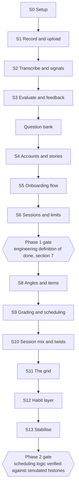

# 03: Delivery Plan

Product: Retell
Status: Draft for approval
Phase: 1
Owner: Deshan Ekanayaka (engineer of record)
Version: 0.3

Implements 01-PRD.md. Architecture decisions are in 02-system-architecture.md and are not
restated here.

## 1. No calendar

This plan has no dates and no estimates. It is an order of work and a set of gates.

A step is done when it meets the definition of done in section 7, not when a week has passed.
Nothing here is committed to anyone outside the project, so a date would be fiction with a
deadline attached.

The order is the part that matters. It is chosen so the riskiest work happens first and every
step produces something that can be used.

**Path B.** A recruited cohort test is unlikely (context/docs-review-decisions.md decision 9).
This plan is written for that reality: Phase 1's gate is engineering, not a behavioural number,
and nothing here waits on recruiting anyone. If a cohort is ever recruited, the diagnostics in
01-PRD.md section 6 become real measurements rather than informal observations, and section 8's
criteria are read against them; nothing else about this plan changes.

**Because there is no cohort to force a stop, Phase 1 needs its own hard stop, set by Deshan.**
Condition based, not a calendar date: **Phase 1 is finished the moment every item in section
7.1's engineering definition of done is checked off, full stop, regardless of what else still
seems improvable.** Without this, the risk is not running out of work, it is never declaring the
work finished (01-PRD.md section 7); the gate exists precisely so that "done" is a checklist
completing, not a feeling arriving.

## 2. Shape of the plan

## 3. Phase 1 steps

Phase 1's gate is the engineering definition of done in section 7, not a behavioural number
(01-PRD.md section 6).

| Step | Ships | Requirements |
| --- | --- | --- |
| S0 | Repo, Next.js, Supabase project, deployed empty app, CI green | none |
| S1 | Record in the browser, upload, play back. Permission screen, Chrome gate | FR-2, FR-14, FR-15, FR-18, FR-34 |
| S2 | Deepgram transcription, word timings, computed duration, pace, longest pause, filler count | FR-16, FR-17 |
| S3 | Evaluation module, three scores, stored separately from facts, feedback screen. Shipped against a single stopgap question (`lib/questions.ts`); the real bank is the next step | FR-19 to FR-24 |
| Question bank | Real per-angle bank (05-spaced-repetition.md section 1.1), roughly three questions per angle plus a twist each, replacing the S3 stopgap. Needed before S6's multi-answer session and before S8 | FR-5, FR-6 |
| S4 | Signup and login, anonymous session claimed on signup, save an answer as a story | FR-7, FR-8, FR-9 |
| S5 | The seven onboarding screens, mic check, tile picker, short answer ladder, skip | FR-1, FR-3, FR-4, FR-5, FR-6, FR-10, FR-11 |
| S6 | Three answers in a session (FR-43), rate limits, kill switch, deletion | FR-12, FR-36, FR-37, FR-38, FR-39, FR-43 |

S1 is first on purpose. Browser audio is the riskiest thing in the build, and finding out late
that it does not work on a real phone would be fatal. S1 to S3 together are one answer end to
end, which is the whole product. Everything after that is plumbing.

**FR-35 (in-app browser detection) is deferred out of S1.** The near term focus is desktop
Chrome. Revisit when mobile or social recruitment is on the table, tracked in
`context/tasks.md`.

## 4. The validation track is cut

An earlier version of this plan tested the mic check's effect on a recruited two-arm cohort
before S5 was built. That test depended on recruiting, which path B (section 1) makes unlikely,
so it is cut rather than left as a step nothing will run.

The mic check ships on the design reasoning already in 04-voice-and-evaluation.md section 1.1
alone: naming the awkward thing before the permission prompt, "it doesn't count for anything"
removing the performance stake, and the first person true sentence being one step rather than
two from talking about yourself. No cohort measurement of its effect exists in Phase 1.

## 5. Phase 2 steps

| Step | Ships | Requirements |
| --- | --- | --- |
| S8 | Angles on questions, item creation on first attempt | FR-26 |
| S9 | Grade derived in code, review rows, interval ladder, due queries, overdue-is-simply-due ordering | FR-27, FR-28 |
| S10 | Session composition (one due, one twist, one new), twist questions | FR-29, FR-30 |
| S11 | The stories against angles grid | FR-32 |
| S12 | Streak, daily reminder | FR-33 |
| S13 | Stabilise, document import | FR-13 |

Phase 3 is not planned here. It starts only if the Phase 2 gate passes.

## 6. Engineering standards

Enforced by CI on every pull request. A failing gate is never weakened, skipped, or marked
flaky to get a merge through.

- `pnpm lint` passes.
- `pnpm typecheck` passes. No `any` in new code without a comment explaining why.
- `pnpm test` passes.
- The build succeeds.

Working practice:

- One branch per feature. No direct commits to the main branch.
- Conventional commits: `feat:`, `fix:`, `chore:`, `docs:`, `refactor:`, `test:`.
- No AI attribution in commit messages.
- Secrets in environment variables only. Never committed, never logged.
- Database changes are migrations, checked in, applied forward only.

Test scope in Phase 1 is deliberately narrow. Unit tests for anything with real logic: the
speech signal computations, the grade derivation, the interval ladder, the session composition.
No tests for pages or layout. Playwright arrives in Phase 2 when the flows stop changing.

## 7. Definition of done

A piece of work is done when all of the following are true.

1. It meets the requirement it cites, and the requirement number is in the pull request.
2. Lint, typecheck, tests and build all pass.
3. It works in Chrome on a real phone, not only on the desktop simulator, for anything that
   touches audio or layout. **Deferred per ADR-012**: desktop Chrome verification is sufficient
   until deployment to friends is imminent (context/docs-review-decisions.md decision 59), at
   which point real-phone testing resumes.
4. Any decision that overrode a previous one is recorded as an ADR.
5. Any document it invalidates has been updated in the same change.
6. Deshan has reviewed the code and can explain what each part does.

Point 6 is not ceremony. The working agreement is that Deshan is the senior engineer on this
project, and code nobody understands is code nobody can change.

### 7.1 Phase 1 gate: engineering definition of done

Reached without a recruited cohort. See 01-PRD.md section 6 for the full table; summarised here
because this is where it is checked.

- Rubric agreement against a self-labelled gold set, measured, corrected after the first run.
- Model self-consistency: identical input returns identical scores across repeated runs.
- Cost per session measured, not estimated.
- Full flow works in Chrome on a real phone.
- Deleting a recording removes the storage object and the row, proven by a test.
- Every item in `context/tasks.md`'s hardening and general-hardening sections closed.

## 8. Kill and pivot criteria

Reviewed at the Phase 1 gate. Written for path B: nothing here depends on a recruited cohort. If
one is ever recruited, 01-PRD.md section 6's diagnostics become real measurements and can be
read alongside these.

| Signal | Meaning | Action |
| --- | --- | --- |
| Rubric agreement against the gold set does not clear its bar (01-PRD.md section 6) | The rubric produces confident nonsense | Stop building on top of evaluation. Fix the anchors or the prompt, re-measure, before anything else |
| Cost per session exceeds 30 pence | The economics do not survive being free | Move to a cheaper model tier, then reconsider the free tier |
| Deshan's own use of the product does not produce feedback he would trust for himself | The value proposition does not hold even for the one person guaranteed to try it | Stop and reconsider the rubric or the elicitation, not the UI |

**A cost accepted in advance.** Retell's habit layer runs on approach rather than loss aversion
(05-spaced-repetition.md section 7.2), regardless of whether that costs day 4 return relative to
a Duolingo-shaped version of this product. There is no cohort number to weigh that trade against
in Phase 1, which removes the usual pressure to revisit it under a disappointing result. The
trade stands on its own reasoning, not on a number confirming it: the banned list in 05 section
7.2 does not reopen.

## 9. Reviews

- **End of each step**: what shipped, what is next. One paragraph in `context/progress.md`.
- **At each gate**: run the criteria in section 8 honestly, and record the outcome as an ADR
  whether it passes or not.
- **Periodically**: check that the documents still describe the real system. Anything that has
  drifted gets fixed or deleted.
