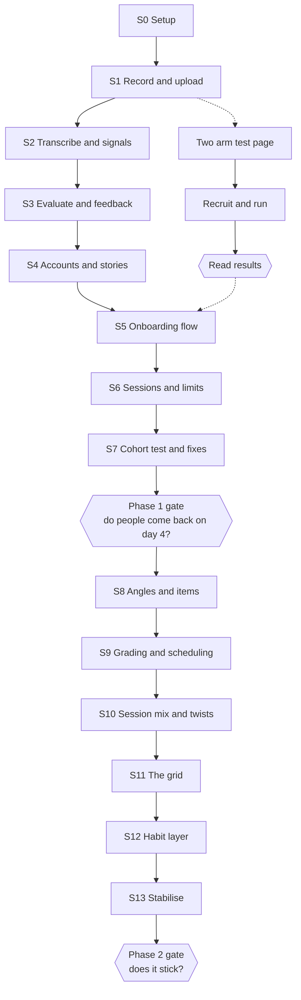

# 03: Delivery Plan

Product: Retell
Status: Draft for approval
Phase: 1
Owner: Deshan Ekanayaka (engineer of record)
Version: 0.2

Implements 01-PRD.md. Architecture decisions are in 02-system-architecture.md and are not
restated here.

## 1. No calendar

This plan has no dates and no estimates. It is an order of work and a set of gates.

A step is done when it meets the definition of done in section 7, not when a week has passed.
Nothing here is committed to anyone outside the project, so a date would be fiction with a
deadline attached.

The order is the part that matters. It is chosen so the riskiest work happens first and every
step produces something that can be used.

## 2. Shape of the plan

The dotted lines are the validation track. It runs alongside the build and its result must be
read before S5 begins.

## 3. Phase 1 steps

The goal of Phase 1 is one question: **do people come back on day four?**

| Step | Ships | Requirements |
| --- | --- | --- |
| S0 | Repo, Next.js, Supabase project, deployed empty app, CI green | none |
| S1 | Record in the browser, upload, play back. Permission screen, Chrome gate | FR-2, FR-14, FR-15, FR-18, FR-34 |
| S2 | Deepgram transcription, word timings, computed duration, pace, longest pause, filler count | FR-16, FR-17 |
| S3 | Evaluation module, three scores, stored separately from facts, feedback screen | FR-19 to FR-24 |
| S4 | Signup and login, anonymous session claimed on signup, save an answer as a story | FR-7, FR-8, FR-9 |
| S5 | The seven onboarding screens, mic check, tile picker, short answer ladder, skip | FR-1, FR-3, FR-4, FR-5, FR-6, FR-10, FR-11 |
| S6 | Five questions in a row, hand written question list, rate limits, kill switch, deletion | FR-12, FR-36, FR-37, FR-38, FR-39 |
| S7 | Cohort test, fixes, measurement | all |

S1 is first on purpose. Browser audio is the riskiest thing in the build, and finding out late
that it does not work on a real phone would be fatal. S1 to S3 together are one answer end to
end, which is the whole product. Everything after that is plumbing.

**FR-35 (in-app browser detection) is deferred out of S1.** The near term focus is desktop
Chrome; testers are not being recruited from social apps yet. This means the secondary
validation measure in section 4 (counting sessions lost to in-app webviews) is not collected
until it is built. Revisit when mobile or social recruitment is on the table, tracked in
`context/tasks.md`.

## 4. Validation track, run alongside

The onboarding flow rests on one unproven claim: that reading a supplied sentence aloud lowers
the barrier to speaking 60 unscripted seconds about yourself. This is tested before S5 builds
on it.

- **Starting at S1**: a static two arm page. Arm A includes the scripted mic check, arm B does
  not. Both record and store. Feedback is a canned message. No backend beyond an upload.
- **Recruit 40 to 60 students** from a single Discord or course group chat, split by link.
  Recruit knowing iPhone users cannot take part, since Phase 1 is Chrome only (FR-34).
- **Primary measure**: percentage who submit an answer of 40 seconds or more containing at
  least one first person action verb. Not completion rate, and not duration alone, because a
  60 second generic non answer scores well on both.
- **Read results before S5 starts.** If arm A does not beat arm B, the mic check is cut and the
  onboarding flow is redesigned before it is built.

Secondary, worth almost as much: post the same link somewhere students will open it on their
phones, and count how many sessions never reach the permission screen because of the in-app
browser. That number decides how much the escape hatch deserves.

## 5. Phase 2 steps

The goal of Phase 2 is one question: **does it stick?**

| Step | Ships | Requirements |
| --- | --- | --- |
| S8 | Angles on questions, item creation on first attempt | FR-26 |
| S9 | Grade derived in code, review rows, interval ladder, due queries | FR-27, FR-28 |
| S10 | Session composition, twist questions | FR-29, FR-30 |
| S11 | The stories against angles grid | FR-32 |
| S12 | Streak, daily reminder | FR-33 |
| S13 | Stabilise, document import | FR-13 |

Phase 3 is not planned here. It starts only if the Phase 2 gate passes.

## 6. Engineering standards

Enforced by CI on every pull request. A failing gate is never weakened, skipped, or marked
flaky to get a merge through.

- `pnpm lint` passes.
- `pnpm typecheck` passes. No `any` in new code without a comment explaining why.
- `pnpm test` passes.
- The build succeeds.

Working practice:

- One branch per feature. No direct commits to the main branch.
- Conventional commits: `feat:`, `fix:`, `chore:`, `docs:`, `refactor:`, `test:`.
- No AI attribution in commit messages.
- Secrets in environment variables only. Never committed, never logged.
- Database changes are migrations, checked in, applied forward only.

Test scope in Phase 1 is deliberately narrow. Unit tests for anything with real logic: the
speech signal computations, the grade derivation, the interval ladder, the session composition.
No tests for pages or layout. Playwright arrives in Phase 2 when the flows stop changing.

## 7. Definition of done

A piece of work is done when all of the following are true.

1. It meets the requirement it cites, and the requirement number is in the pull request.
2. Lint, typecheck, tests and build all pass.
3. It works in Chrome on a real phone, not only on the desktop simulator, for anything that
   touches audio or layout. **Deferred per ADR-012**: through S1, desktop Chrome verification
   is sufficient; real-phone testing resumes before the validation page recruits testers.
4. Any decision that overrode a previous one is recorded as an ADR.
5. Any document it invalidates has been updated in the same change.
6. Deshan has reviewed the code and can explain what each part does.

Point 6 is not ceremony. The working agreement is that Deshan is the senior engineer on this
project, and code nobody understands is code nobody can change.

## 8. Kill and pivot criteria

Reviewed at the Phase 1 gate.

| Signal | Meaning | Action |
| --- | --- | --- |
| Fewer than 25 percent of testers produce a usable first answer | The core act is too hard, or the first question is wrong | Pivot the onboarding, not the product. Rerun the two arm test |
| Day 4 return under 10 percent | Nobody wants a daily speaking habit | Pivot away from daily. Reposition as interview week preparation and drop the spaced repetition entirely |
| Day 4 return between 10 and 25 percent | Weak but alive | Continue to Phase 2, and treat the habit layer as the thing being tested |
| Users produce fewer than 3 stories by session 5 | Elicitation does not work | Stop and fix elicitation. Everything downstream depends on stories existing |
| Feedback is judged useless by more than half of testers | The rubric is wrong | Stop building, fix the rubric against real answers before anything else |
| Cost per session exceeds 30 pence | The economics do not survive being free | Move to a cheaper model tier, then reconsider the free tier |

**Kill criterion.** If day 4 return is under 10 percent and testers say the feedback is not
useful, stop. That combination means neither the habit nor the value proposition holds, and no
amount of Phase 2 work fixes it.

## 9. Reviews

- **End of each step**: what shipped, what is next. One paragraph in `context/progress.md`.
- **At each gate**: run the criteria in section 8 honestly, and record the outcome as an ADR
  whether it passes or not.
- **Periodically**: check that the documents still describe the real system. Anything that has
  drifted gets fixed or deleted.
