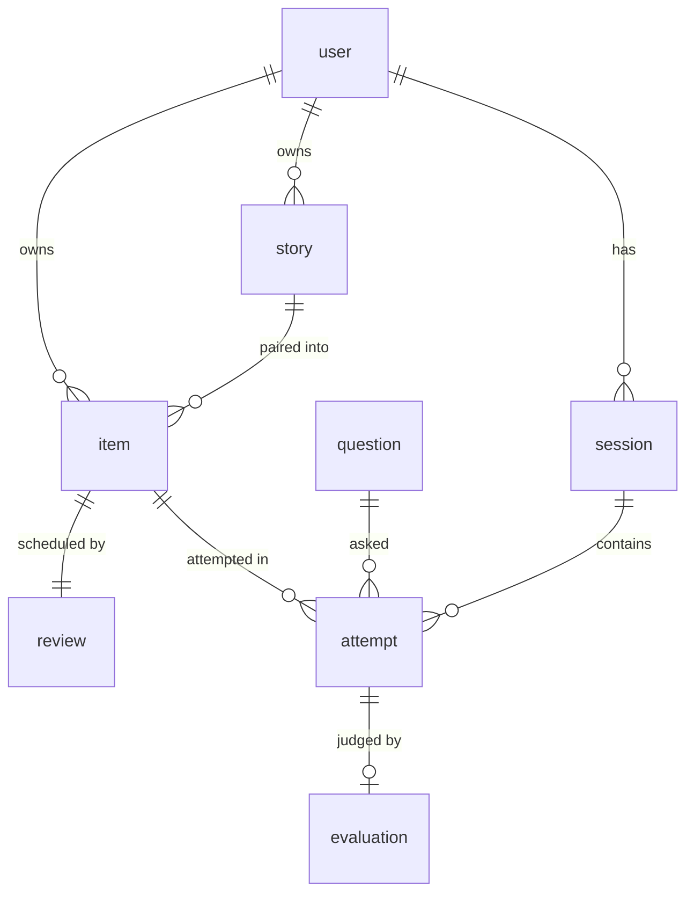

# 06: Data and Privacy

Product: Retell
Status: Draft for approval
Owner: Deshan Ekanayaka (engineer of record)
Version: 0.1

Owns the schema, retention, and what Retell promises users about their recordings. Implements
FR-8, FR-15, FR-20, FR-21, FR-38, FR-39 of 01-PRD.md.

## 1. The position

Users record themselves being bad at something, usually alone in their room, often anxious.
That is a higher trust bar than most products carry, and it is easy to lose once and impossible
to regain.

Three promises, which are product rules and not marketing copy:

1. **Nobody else ever hears it.** No feed, no sharing, no browsing other users' answers, no
   public anything (01-PRD.md section 5).
2. **It is never used to train a model without explicit opt in** (FR-39). Opt in means a
   deliberate action, not a pre-ticked box and not a line in terms of service.
3. **Delete means delete** (FR-38). Audio removed from storage, rows removed from the database,
   not a flag on a row that hides it.

## 2. Schema

### user

| Column | Notes |
| --- | --- |
| `id` | |
| `email` | |
| `name` | |
| `target_role` | Optional. Shapes question selection from Phase 2 |
| `timezone` | Decides when "today" resets for streaks and due dates |
| `training_opt_in` | Default false. Never defaulted true (FR-39) |
| `created_at` | |

### story

| Column | Notes |
| --- | --- |
| `id`, `user_id` | |
| `title` | Confirmed by the user, not generated |
| `body` | The user's own transcript. Never generated (FR-9) |
| `source` | `spoken` or `written` |
| `audio_url` | The recording it came from, if spoken |
| `created_at`, `updated_at` | |

### question

| Column | Notes |
| --- | --- |
| `id` | |
| `angle` | Slug. A contract, see 05-spaced-repetition.md section 1.1 |
| `text` | The wording asked. Never contains a competency word (FR-6) |
| `is_twist` | |
| `parent_question_id` | The plain question this twists |
| `created_at` | |

### item

| Column | Notes |
| --- | --- |
| `id`, `user_id` | |
| `story_id` | |
| `angle` | Not `question_id`. This is the load bearing decision |
| `status` | `active` or `retired` |
| `created_at` | |

Unique on `(user_id, story_id, angle)`.

### session

| Column | Notes |
| --- | --- |
| `id`, `user_id` | |
| `started_at`, `completed_at` | |
| `status` | `in_progress`, `complete`, `abandoned` |

### attempt

Facts only. Nothing here is an opinion.

| Column | Notes |
| --- | --- |
| `id`, `user_id`, `session_id` | |
| `item_id` | Null for onboarding answers, which create a story but no item |
| `question_id` | |
| `audio_url` | |
| `duration_ms` | |
| `transcript` | |
| `word_timings` | jsonb, from Deepgram |
| `filler_count`, `words_per_minute`, `longest_pause_ms` | Computed, never inferred (FR-17) |
| `assisted` | Story text was visible. Never changes a schedule (FR-31) |
| `created_at` | |

### evaluation

One model's judgement of one attempt.

| Column | Notes |
| --- | --- |
| `id`, `attempt_id` | |
| `model` | The model identifier used |
| `rubric_version` | Incremented whenever the prompt or anchors change (FR-20) |
| `relevance`, `structure`, `specificity` | 0 to 3 |
| `grade` | `again`, `hard`, `good`, `easy`. Derived in code (FR-27) |
| `gap` | One sentence, phrased as a question |
| `angles` | Angles this answer could serve |
| `created_at` | |

### review

| Column | Notes |
| --- | --- |
| `id`, `item_id` | Unique on `item_id` |
| `due_at`, `interval_days` | |
| `reps`, `lapses` | |
| `last_grade`, `last_attempt_at` | |

## 3. Why facts and judgements are separate tables

`attempt` holds what happened. `evaluation` holds what a model thought about it, stamped with
which model and which rubric produced the thought (FR-21).

This buys three things:

- **Model changes are cheap.** Re-score every historical attempt without re-recording anything.
- **Scores stay comparable.** A progress chart can exclude or separate scores from a different
  rubric version, instead of showing a student improving on the day of a deploy.
- **Rubric tuning has a corpus.** Threshold changes can be replayed over real answers.

An attempt may have zero evaluations (transcription failed, or it was under 15 seconds) or, in
future, more than one.

## 4. Retention

| Data | Kept | Deleted |
| --- | --- | --- |
| Raw audio, signed up user | Indefinitely, until the user deletes it (FR-15) | On user request, or with the account |
| Raw audio, anonymous session | 24 hours (FR-8) | Automatically if unclaimed |
| Mic check audio | With the user, flagged `mic_check`, never transcribed | With the account |
| Transcripts and evaluations | With the attempt | With the attempt |
| Account | Until deleted | Immediately on request, with all audio and rows |

Audio is retained indefinitely because it is the only thing that cannot be recreated, and
everything downstream derives from it. That is a deliberate trade of storage cost and
responsibility against the ability to fix any mistake made upstream of it.

## 5. Anonymous sessions

Feedback is shown before signup (FR-7), so a recording exists before an account does.

- An anonymous session id is stored in a cookie.
- Audio and its attempt are written against that id.
- On signup the rows are claimed by the new user.
- Unclaimed after 24 hours, everything is deleted.
- One anonymous answer per IP per day (FR-36), which is what stops the URL being a free
  transcription API for anyone who finds it.

The privacy copy on the permission screen must be true at this point, before an account exists.
It is.

## 6. Access rules

- Row level security on every table. A user reads and writes only their own rows.
- Audio files are private. Access is by short lived signed URL only, never a public bucket path.
- `question` is the only shared table.
- No admin interface in Phase 1. Corpus inspection is done with SQL, and looking at a
  identifiable user's recordings is not a routine activity.

## 7. What is not collected

- No analytics beyond the metrics in 01-PRD.md section 6.
- No third party trackers, no advertising pixels, no session replay.
- No contacts, no location, no device fingerprinting.
- No demographic data. Nothing in the product needs to know a user's age, gender or nationality,
  and collecting it would invite scoring differences nobody can defend.

## 8. Decided

- Mic check audio is stored, flagged `mic_check`, never transcribed or evaluated.
- **Deleting audio deletes its transcript and evaluation too.** Deletion removes everything
  derived from the recording, not just the file. A retained transcript of a deleted recording
  would make the promise in section 1 false.

## 9. Open action

Not a decision, a fact to verify: confirm the data processing terms with Deepgram and the model
provider, and that their defaults are no retention and no training on submitted audio. The
promises in section 1 are only true if their settings agree. Required before any real user other
than a recruited tester.
