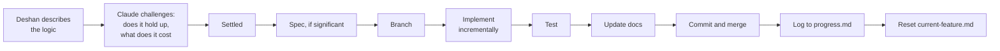

# Development Workflow

The working loop for Retell. The short operational version lives in `context/ai-interaction.md`.
This document explains the system and when each file updates.

## 1. The three layers

| Layer | Location | Nature | Loaded by AI |
| --- | --- | --- | --- |
| Strategy, source of truth | `docs/` | Slow changing product, architecture and delivery decisions | On demand, by reference |
| Decisions | `docs/decisions/` | Append-only ADRs: why, alternatives, consequences | When touching an affected area |
| Working context | `context/` | Fast changing: overview, standards, interaction rules, active feature, tasks, progress | Every session via `CLAUDE.md` |

The strategy docs are too large to load every session, so `context/` carries a compact summary
plus pointers. **If `context/` and `docs/` disagree, `docs/` wins and `context/` gets fixed.**

## 2. Who does what

Deshan is the engineer of record. The working agreement is a collaboration: Deshan owns the
design, the logic and the direction; Claude writes the code and challenges the approach before
writing it, not after.

Founder authored, propose only. Claude may draft and argue, never decide:

- The scoring rubric and how grades are derived
- Scheduling rules and intervals
- Anything shown to a user as a claim about their ability
- Privacy handling of recordings
- Pricing, when it exists

## 3. Feature lifecycle

**Step B is not optional.** If an approach has a problem, the useful moment to say so is when
it is described, not when 300 lines rest on it. The cost is stated in days, not in technical
terms, so the design decision is made with the price visible.

**Sizing rule.** Anything touching more than one file, any schema change, any contract (angle
slug, error code, rubric version, event type), or any model behaviour is significant and gets a
spec in `context/features/`. Below that, fix directly, but still log it to `progress.md` if a
user would notice.

## 4. Clarifying questions

Ambiguity is resolved before implementation, in one batched message, at the plan step. Guessing
at an ambiguous requirement and implementing the guess is a workflow failure even when the code
works.

## 5. When each document updates

| Document | Updated when | By |
| --- | --- | --- |
| `docs/01-PRD.md` | Scope, personas, requirements or success metrics change | Deshan, with an ADR if it reverses something |
| `docs/02-system-architecture.md` | Implemented code diverges from the design, in the same branch | Whoever changes the code |
| `docs/03-delivery-plan.md` | Step order changes, or a gate is reviewed | Deshan |
| `docs/04-voice-and-evaluation.md` | The rubric, prompt, anchors, signals or capture rules change | Deshan approves; rubric version increments |
| `docs/05-spaced-repetition.md` | Grading thresholds, intervals, or session composition change | Deshan approves |
| `docs/06-data-and-privacy.md` | Any schema change, retention change, or new data collected | Same PR as the migration |
| `docs/decisions/` | A decision overrides a previous one, closes a debate, or gets questioned twice | Claude drafts, Deshan approves |
| `docs/workflow/` | The process itself changes | Deshan |
| `context/project-overview.md` | Its summary of `docs/` goes stale | Same PR that changed `docs/` |
| `context/coding-standards.md` | A pattern is adopted or retired | With the PR that establishes it |
| `context/ai-interaction.md` | The working agreement changes | Deshan |
| `context/current-feature.md` | Continuously during a feature, reset at completion | Claude |
| `context/tasks.md` | Task state changes | Immediately, either party |
| `context/progress.md` | One line per completed piece of work | Claude, at completion |
| `context/features/*.md` | Before implementation, amended if requirements move mid feature | Deshan writes or approves |

## 6. Definition of done

From `docs/03-delivery-plan.md` section 7, repeated here because it is the rule most often
skipped:

1. It meets the requirement it cites, and the FR number is in the pull request.
2. Lint, typecheck, tests and build all pass.
3. It works in Chrome on a real phone, for anything touching audio or layout.
4. Any overriding decision is recorded as an ADR.
5. Any document it invalidates is updated in the same change.
6. Deshan has reviewed the code and can explain what each part does.

## 7. Reviews

- **End of each step**: one paragraph in `context/progress.md`.
- **At each gate**: run the kill and pivot criteria honestly, record the outcome as an ADR
  whether it passes or fails.
- **Periodically**: check the docs still describe the real system. Anything drifted is fixed or
  deleted.
